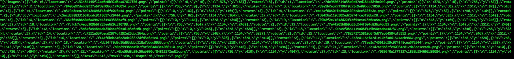

# imageEncrypt

imageEncrypt包提供对图片进行切片和随机旋转角度来达到对图片加密的效果；也可对切片后的图片进行复位拼装还原图片。
  
接口：Cut(对原始图片进行切片)、Assembe(切片后的图片进行还原)、Storage(对切片后的图片进行存储)、Meta(对切片后图片元信息进行存储)
  
依赖：go1.6、github.com/sosop/imaging(支持多种图片格式的简单操作)

# 安装

`go get -u github.com/sosop/imaging
go get -u github.com/sosop/imageEncrypt`

# 文档


```PACKAGE DOCUMENTATION

package imageEncrypt
    import "."

    Package imageEncrypt assembe interface is restoring image


    Package imageEncrypt cut is Cutting Image

    Package imageEncrypt models


    Package imageEncrypt meta information

    Package imageEncrypt storage is storing the splice image

CONSTANTS

const (
    // DefaultPatitionX default cols
    DefaultPatitionX = 4
    // DefaultPatitionY default rows
    DefaultPatitionY = 4
)

const (
    Rectangle = iota
    RightTriangle

    // Degree0
    Degree0 = iota
    // Degree90
    Degree90
    // Degree180
    Degree180
    // Degree270
    Degree270
)
    shape of cutting

TYPES

type Assembe interface {
    // contains filtered or unexported methods
}
    Assembe it's a interface. Implement this interface

type Cut interface {
    Cutting(reader io.Reader, filename string, condition ...interface{}) (MetaCuttedImage, error)
}
    Cut interface

type CuttedImage struct {
    ID       int     `json:"id"`
    Location string  `json:"location"`
    Points   []Point `json:"points"`
    Rotate   int     `json:"rotate"`
}
    CuttedImage splice image

type FileStorage struct {
    // contains filtered or unexported fields
}
    FileStorage Use file system to store splice image

func NewFileStorage(dir string) *FileStorage
    NewFileStorage constructor

type FileSystemAssembe struct {
    // contains filtered or unexported fields
}
    FileSystemAssembe Read slice image from the file system and restore

func NewFileSystemAssembe(s Storage, m Meta) *FileSystemAssembe
    NewFileSystemAssembe constructor

type Meta interface {
    // contains filtered or unexported methods
}
    Meta interface of meta information

type MetaByRedis struct {
    // contains filtered or unexported fields
}
    MetaByRedis Use redis store the meta info

func NewMetaByRedis(addr, pass string) *MetaByRedis
    NewMetaByRedis constructor

type MetaCuttedImage struct {
    Images []CuttedImage `json:"images"`
    MaxX   int           `json:"maxX"`
    MaxY   int           `json:"maxY"`
    Shape  int           `json:"shape"`
    Ext    string        `json:"ext"`
}
    MetaCuttedImage meta information

type Point struct {
    X int `json:"x"`
    Y int `json:"y"`
}
    Point

type RectangleCut struct {
    // contains filtered or unexported fields
}
    RectangleCut cutting image to litle Rectangle image

func NewDefaultRectangleCut(storage Storage, meta Meta) *RectangleCut
    NewDefaultRectangleCut constructor

func NewRectangleCut(partitionX, patitionY int, storage Storage, meta Meta) *RectangleCut
    NewRectangleCut constructor

func (r RectangleCut) Cutting(reader io.Reader, filename string, condition ...interface{}) (*MetaCuttedImage, error)
    Cutting implement the interface of Cut

type Storage interface {
    // contains filtered or unexported methods
}
    Storage interface

SUBDIRECTORIES

	test-asserts
```

# Examples

切割原始图片
	
```// 切片图片为文件存储方式，存储路径为当前目录
	s := imageEncrypt.NewFileStorage("./")

	//元信息用redis存储
	m := imageEncrypt.NewMetaByRedis("127.0.0.1:6379", "test")

	// 将图片切割为6行4列
	c := imageEncrypt.NewRectangleCut(4, 6, s, m)

	// 读取将要切割图片
	f, err := os.Open("/Users/mac/Downloads/test1.png")
	if err != nil {
		return
	}
	defer f.Close()

	// 第一个参数：文件流
	// 第二个参数：图片名
	// 第三个参数：元信息存储的查询条件(这里表示redis中的key)
	c.Cutting(f, "test1.png", "test-1")
```
元信息


还原图片
	
```// 元数据存储接口
	m := NewMetaByRedis("127.0.0.1:6379", "test")

	// 切片图片存储接口
	s := NewFileStorage("./")

	// 还原图片
	a := NewFileSystemAssembe(s, m)
	_, err := a.assembing("test1")
	if err != nil {
		log.Fatal(err)
	}
```

